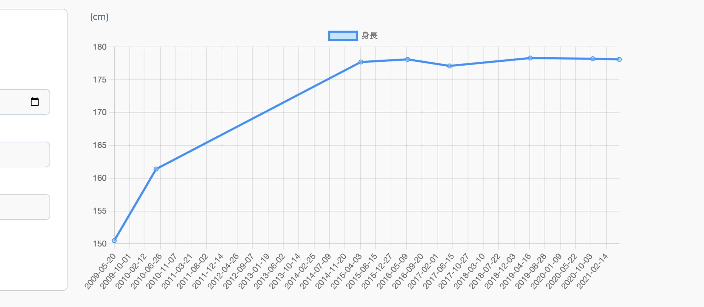
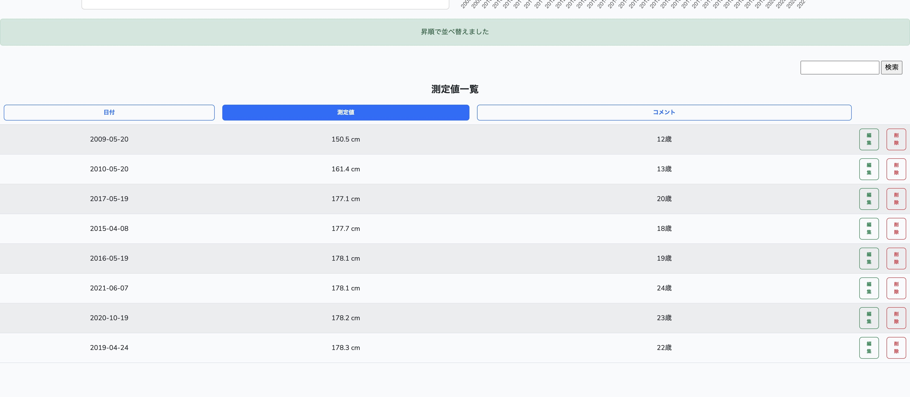
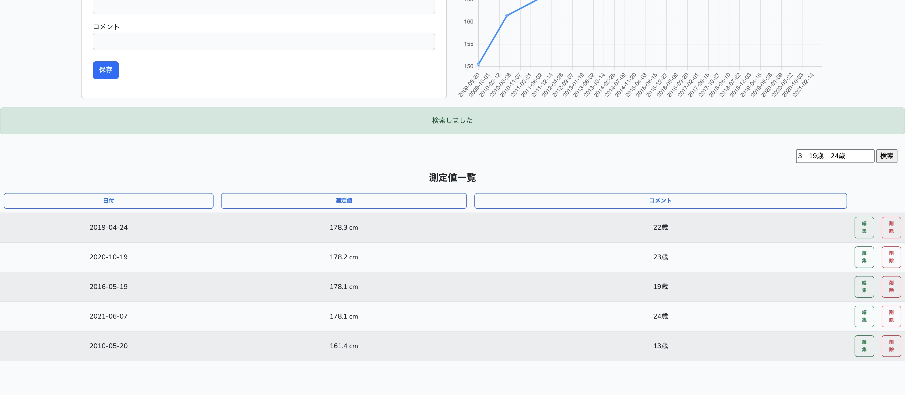
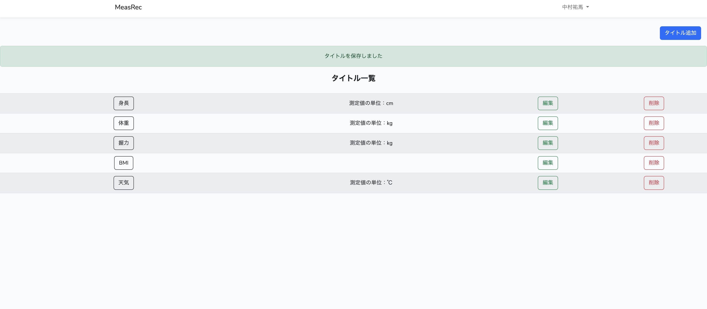

# MeasRec

測定値を記録するアプリです。Measure Recordを略して、「MeasRec」と命名しました。

以下のリンクにアクセスすると、Webアプリ「MeasRec」のページに移動します。

・[MeasRec](http://measrec.s239.xrea.com/measrec.s239/)

※Webアプリのリンクにアクセスすると、最初にログイン認証の画面が表示され、登録を行うことになります。その際に、取得したメールアドレスなどの個人情報はWebアプリの認証にのみ使用します。安心してお使いください。

   

1. 入力した値がグラフに反映されて、傾向を把握することができます。

  

2. 項目ボタンを押すと、その項目で並び順が入れ替わります。ボタンを押すたびに昇順と降順が切り替わります。

  

3. 検索ボックスに探したいキーワードを入力してボタンを押すと、該当するキーワードを測定値一覧に表示します。複数キーワードの検索にも対応しております。

  

4. タイトル追加ボタンを押すとタイトル入力フォームに遷移し、タイトルを追加することができます。タイトル一覧に表示されたタイトル名のボタンを押すと、グラフや測定値一覧の画面に遷移します。

   

# 開発環境
- PHP 8.0.18
- Composer 2.4.2
- Laravel Framework 9.42.0
- MySQL 8.0.28
- Chart.js 4.1.1
